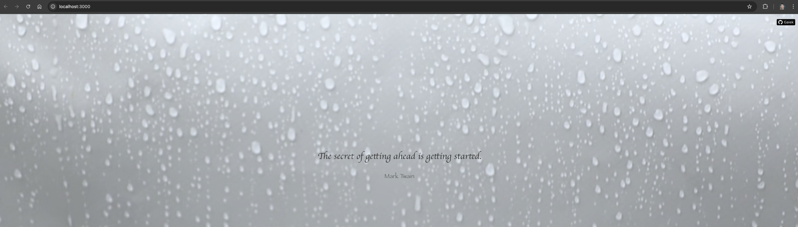

# Getting Started with Create React App

 Esse é um projeto básico que usa React para fazer uma chamada na Api listada abaixo, possui baixo nível de complexidade. Acredito que todo projeto carece de melhorias caso tenha alguma sugestão não deixe de adicionar :)

## Running the project

* `git clone nome-do-repositório`
* `yarn`
* `yarn dev`

Runs the app in the development mode.\
Open [http://localhost:3000](http://localhost:3000) to view it in your browser.

The result will be something like:

### Api usada
https://github.com/mohamadayash22/real-inspire/tree/main?tab=readme-ov-file#get-random-quote